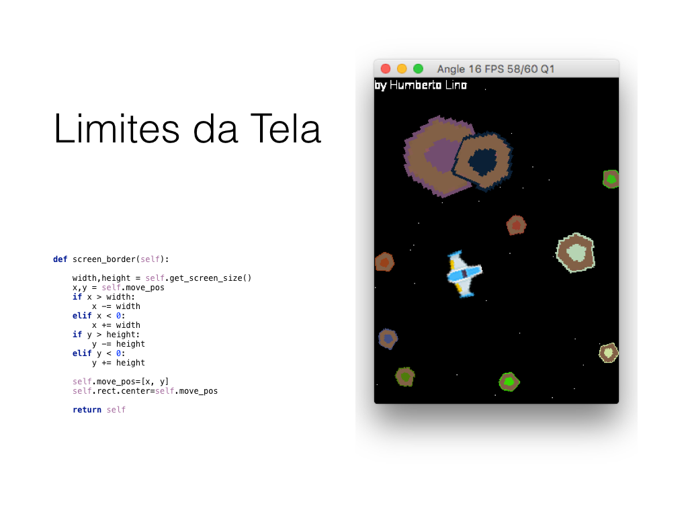

# Asteróides

Jogo Asteróides utilizando pygame com suporte:

* Teclado
* Mouse
* TouchScreen
* Joystick
* Asteróides configuráveis

## Documentação

* [Enunciado](doc/enunciado.pdf)
* [PDF](doc/pdf/api.pdf)
* [HTML](doc/html/index.html)

## Como instalar?

### Mac

```
brew install python3
curl -L bootstrap.pypa.io/get-pip.py | python3
pip3 install hg+http://bitbucket.org/pygame/pygame
```

### Linux

```
sudo apt-get install python3 curl
curl -L bootstrap.pypa.io/get-pip.py | python3
pip3 install hg+http://bitbucket.org/pygame/pygame
```


### Windows

1) Para **Windows 7 e 8** instale:	
	
**Este passo não é necessário no Windows 10***
 
Instale o [Visual C++ Redistributable for Visual Studio 2015](https://www.microsoft.com/en-us/download/details.aspx?id=48145)
 


OBS: **Windows 7 requer o Service Pack 1**.


2) Baixe e descompacte o arquivo comprimido que contém o jogo compilado, a seguir execute **main.exe** para jogar.
	
[https://www.dropbox.com/s/mah81oqqu1pf0fc/pygame-asteroids-main.dist.zip?dl=0]
(https://www.dropbox.com/s/mah81oqqu1pf0fc/pygame-asteroids-main.dist.zip?dl=0)

ou se possuir o python e o pygame instalados, execute:

```
python main.py config.txt
```

Video com passo a passo da instalação
	

[](https://github.com/humbertodias/pygame-sdl1-asteroids-pc/blob/master/doc/how_to_install/steps.mp4?raw=true)


## Como configurar?

Para modificar o comportamento do jogo, edite o arquivo **config.txt**

``` 
# janela 640 480, 800 600, 1024 768
janela 800 600

# controle mouse keyboard touch joystick
controle mouse

# tela_cheia True, False
tela_cheia False

# mostrar_mouse True, False
mostrar_mouse True

# sound True, False
sound True

passo_simulacao 60

vidas 3

asteroide 100 100 50 ff0000
asteroide 150 150 30 80eca7
asteroide 300 200 20 fff600
asteroide 50 50 35 fff6ab
asteroide 0 0 0

```

## Jogo

### Franquia


### Classificação


### Menu


### Controles
1 - Mouse


2 - Teclado


3 - Joystick


4 - TouchScreen


### Pontuação


### Créditos


### Jogo


## Apresentação
[presentation.key](doc/presentation.key)





